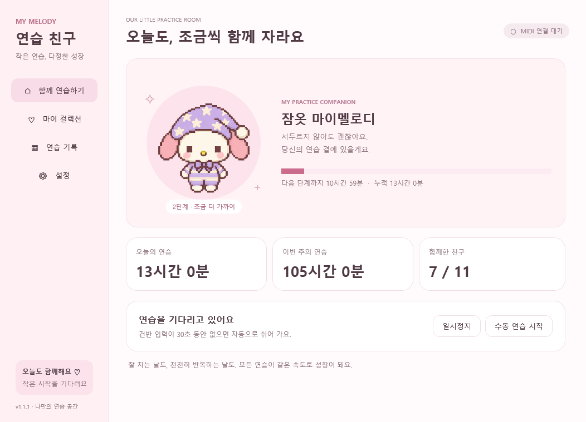
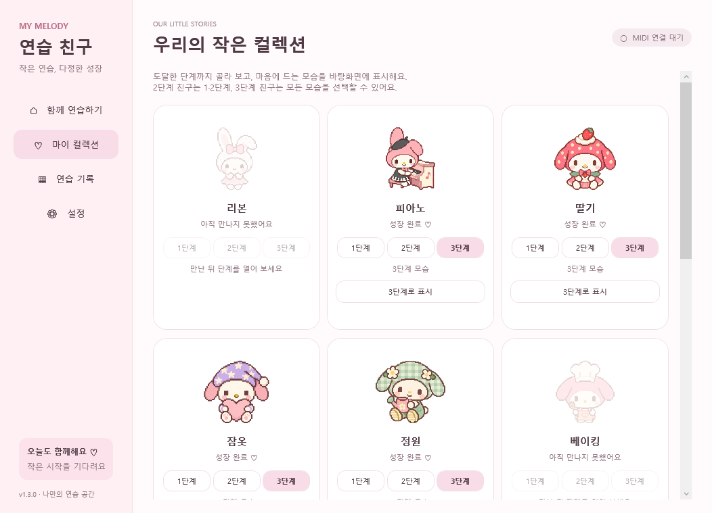
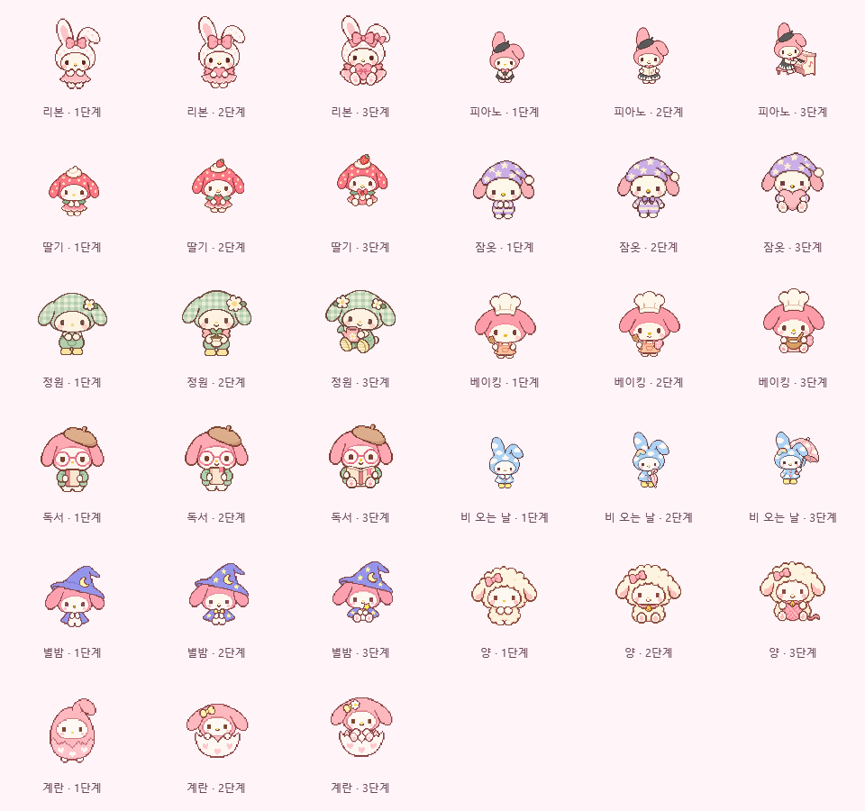
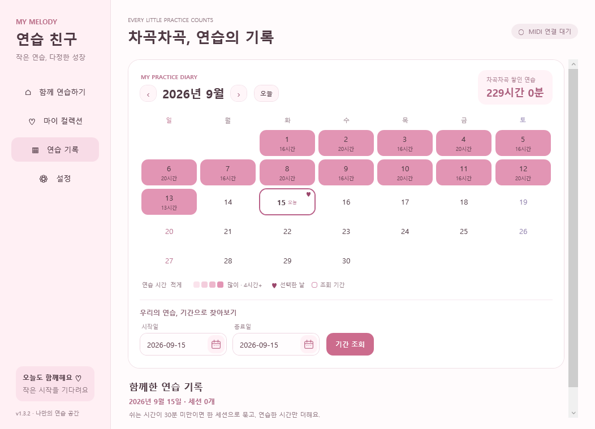
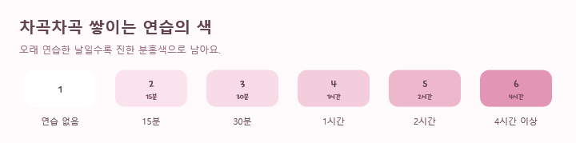

# 마이멜로디 연습 친구

MIDI 건반을 연습하면 함께 자라는 작은 Windows 데스크톱 친구입니다.



위 화면의 시간과 수집 상태는 기능 검증을 위해 만든 시험 기록입니다.

## 시작하기

[최신 릴리스](https://github.com/JjangguKkilolo/mymelody/releases/latest)에서 `MyMelodyPractice-win-Setup.exe` 또는 `MyMelodyPractice-win-Portable.zip`을 받습니다. 포터블은 ZIP을 폴더 전체로 풀고 **마이멜로디 연습 친구.exe**를 실행하세요.

1. **첫 친구 만나기**를 눌러 마이멜로디를 뽑습니다.
2. **설정 → 연습 입력**에서 사용하는 MIDI 건반을 선택합니다.
3. 건반을 치면 자동 기록됩니다. Cakewalk가 꺼져 있어도 동작합니다.
4. 입력이 멈추면 30초의 여유 시간 후 자동으로 쉽니다. 악보 읽기 등은 **수동 연습 시작**으로 기록할 수 있습니다.

Windows x64용이며 .NET 런타임은 앱에 포함됩니다. Cakewalk와 동시에 입력을 받을 수 있는지는 MIDI 장치 드라이버의 다중 앱 연결 지원에 따라 달라집니다.

## 함께 성장하기

| 누적 연습 | 변화 |
|---|---|
| 0시간 | 1단계 |
| 12시간 | 2단계 · 새로운 표정 |
| 24시간 | 3단계 · 테마 소품 |
| 36시간 | 성장 완료 · 다음 친구 뽑기 |

리본, 피아노, 딸기, 잠옷, 정원, 베이킹, 독서, 비 오는 날, 별밤, 양, 계란, 공룡의 12종입니다. 테마마다 도트 의상·귀 모양·자세가 다르고, 성장하면 표정과 소품이 더해집니다. 아직 없는 친구 중 무작위로 뽑으며 중복은 없습니다. 한 번에 한 친구만 자라고 완성한 친구는 언제든 바탕화면에 표시할 수 있습니다. 표시 대상과 육성 대상은 별개입니다. 새 친구를 뽑기 전의 연습은 기록만 쌓입니다.

업데이트 후에도 수집 상태·성장 단계·연습 기록은 유지됩니다. 기존 11종을 모두 완성했다면 새 공룡 친구를 바로 만날 수 있습니다.

컬렉션에서 **1·2·3단계** 버튼으로 도달한 모습까지 다시 볼 수 있습니다. 2단계 친구는 1·2단계, 3단계 친구는 1·2·3단계를 선택할 수 있고, 아직 도달하지 않은 단계는 잠겨 있습니다. 원하는 단계를 고른 뒤 **‘N단계로 표시’**를 누르면 바탕화면 모습을 고정합니다. 미리보기만으로 팝업이 바뀌지는 않습니다.

이전 모습을 표시해도 실제 성장 단계와 연습 기록은 유지되고, 현재 육성 중인 친구에게 연습 시간이 계속 쌓입니다. **성장에 맞춰 표시**를 누르면 선택한 친구의 현재 모습을 표시하고, 성장할 때 자동으로 바꿉니다. 표시 선택은 재시작·백업 복원·업데이트 후에도 유지됩니다. 새 친구를 뽑으면 기존 동작대로 새 친구를 성장에 맞춰 표시합니다.



모든 친구는 투명 여백을 제외한 외형의 높이와 바닥선을 맞춰 표시합니다. 귀·의상·소품의 비율을 유지하며, 눈을 깜빡일 때도 같은 배율로 표시합니다. 새 종류가 추가되어도 기존 친구들의 표시 크기는 바뀌지 않습니다.



## 기록과 사용 편의

- 오늘·이번 주·전체 시간, 월별 달력과 세션 기록
- 달력은 연습한 시간이 길수록 진한 분홍색으로 표시합니다. 기록이 없으면 흰색이며, 하루 4시간 이상은 가장 진한 색을 사용합니다. 하루 선택은 하트, 조회 기간은 테두리로 구분합니다. 날짜 입력창과 펼쳐지는 달력도 앱의 분홍색 분위기에 맞췄습니다.
- **연습 기록**을 열 때마다 PC의 현재 날짜에 해당하는 오늘 기록만 표시합니다. 달력에서 다른 하루를 선택하거나 시작일·종료일을 입력하고 **기간 조회**를 누르면 양 끝 날짜를 포함한 기록을 볼 수 있습니다. 같은 날짜를 다시 눌러도 선택이 유지되고, 목록 위에서 조회 날짜와 세션 수를 확인할 수 있습니다.
- 같은 날짜·같은 기록 방식에서 연습 구간 사이의 휴식이 30분 미만이면 한 세션으로 표시합니다. 기존의 짧은 기록도 묶어 보여 주며, 쉬는 시간은 합산하지 않습니다.
- 캐릭터 크기 48–384 DIP, 드래그 이동, 항상 위에 표시, 숨기기
- 드래그를 끝내거나 화면 배치가 바뀌면 캐릭터를 실제 모니터 작업 영역 안으로 보정합니다. 화면 위아래·좌우, 작업표시줄과 모니터 사이의 빈 공간을 고려합니다.
- 트레이 아이콘에서 열기·숨기기·일시정지·종료
- Windows 로그인 시 자동 실행 (설정에서 선택, 기본 꺼짐)
- 창의 닫기 버튼은 트레이로 숨깁니다. 완전히 끝내려면 트레이의 **종료**를 사용하세요.
- 5초마다 자동 저장, 일일 백업 최근 7개, 백업 내보내기·복원
- PC 잠금·절전·MIDI 연결 해제 시 자동 기록 중단





개인 데이터는 `%AppData%\MyMelodyPractice`에만 저장합니다. 프로그램 업데이트와 독립된 위치이며, GitHub로 연습 기록을 업로드하지 않습니다.

## 업데이트

실행 시와 6시간마다 공개 GitHub Releases에서 새 정식 버전을 확인합니다. **업데이트하고 다시 시작**을 누르기 전에는 다운로드·설치하지 않습니다. 설치 전 기록을 저장하고 백업합니다. 설정에서 자동 확인을 끄거나 직접 확인할 수 있습니다.

## 개발

.NET 10 SDK가 필요합니다. 저장소의 `global.json`에 SDK 버전이 고정되어 있습니다.

```powershell
dotnet build MyMelody.slnx -c Release
dotnet test MyMelody.slnx -c Release
dotnet run --project src/MyMelody.App
```

저장소 안에 SDK를 따로 준비했다면 `dotnet` 대신 `.\.tooling\dotnet\dotnet.exe`를 사용합니다.

```powershell
./scripts/package.ps1 -Version 1.3.2
```

`vMAJOR.MINOR.PATCH` 태그를 push하면 GitHub Actions가 테스트·빌드·패키징 후 모든 파일을 릴리스 초안에 업로드하고 게시합니다. 설치형·포터블·업데이트 패키지와 체크섬 파일이 포함됩니다.

검증 범위와 재현 방법은 [검증 문서](docs/verification.md), [친구에게 전달할 테스트 안내](docs/friend-testing.md), 그림 생성 프롬프트는 [아트 문서](docs/art-prompts.md)를 참고하세요.

앱 아이콘 원본과 생성 프롬프트·Windows ICO 재생성 방법은 [아이콘 제작 기록](docs/icon-art.md)에 있습니다.

개인용 비공식 팬 프로젝트입니다. My Melody 캐릭터는 Sanrio의 캐릭터이며 이 앱은 Sanrio의 공식 제품이 아닙니다.
